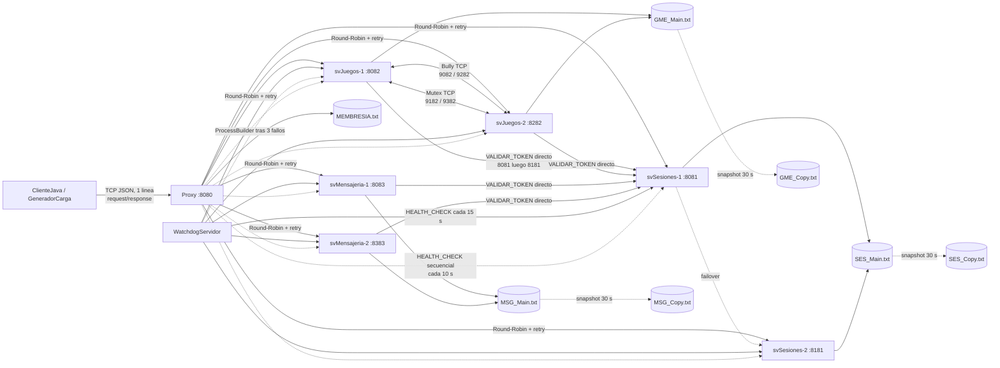
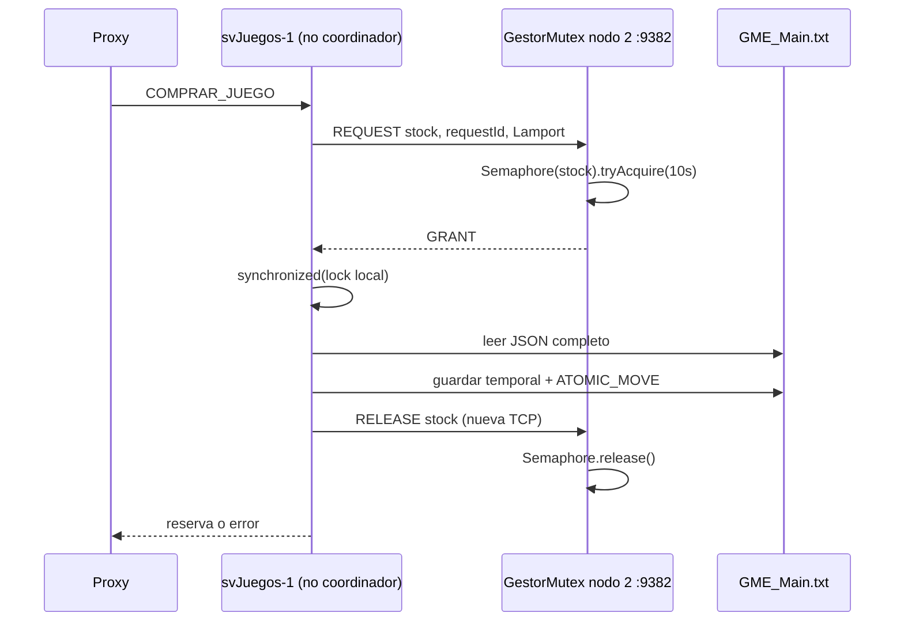
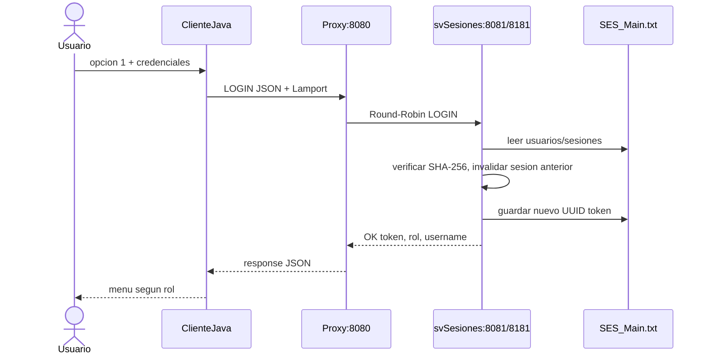
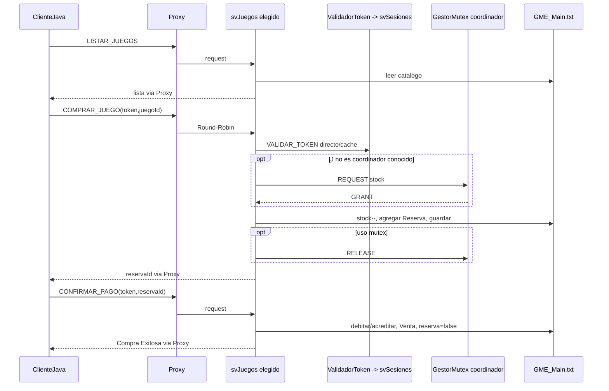
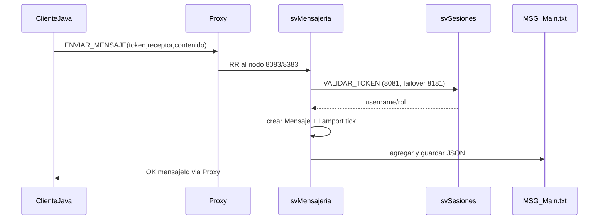
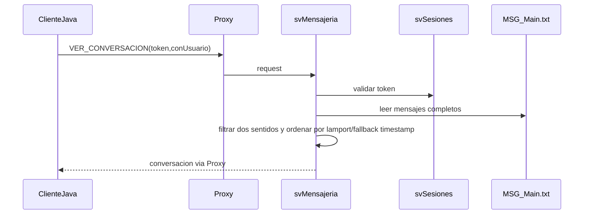
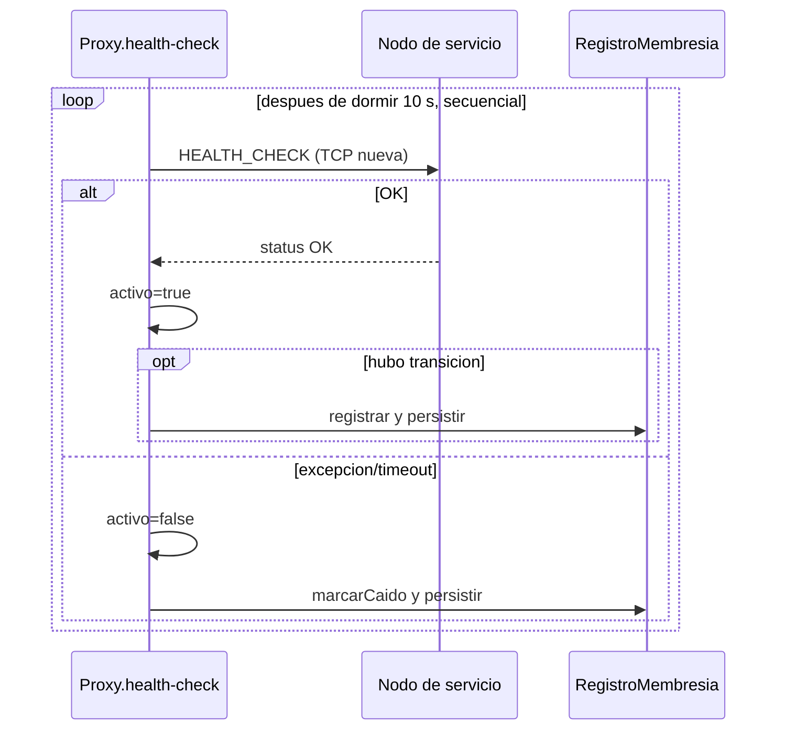
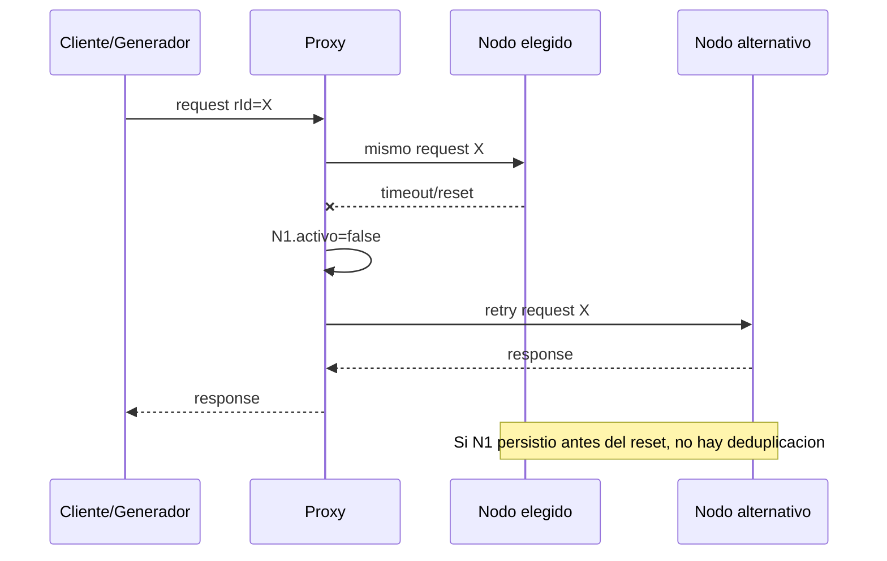
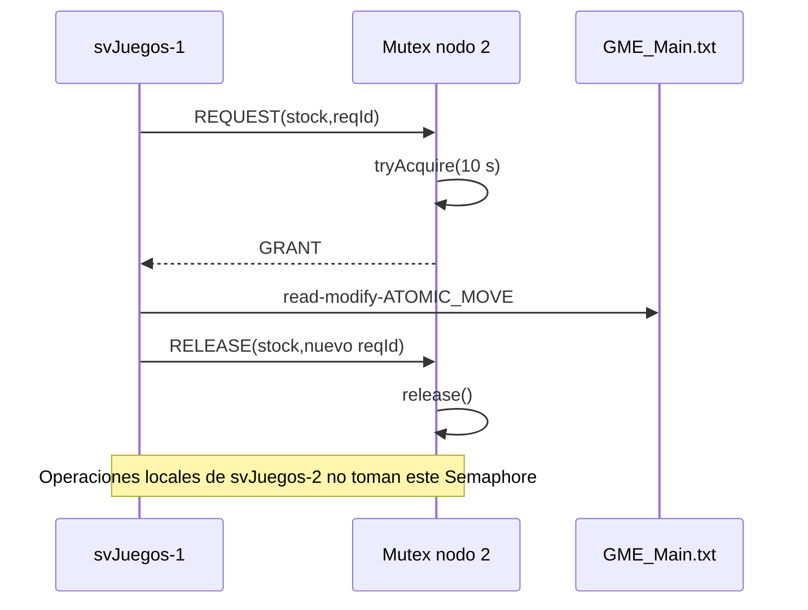
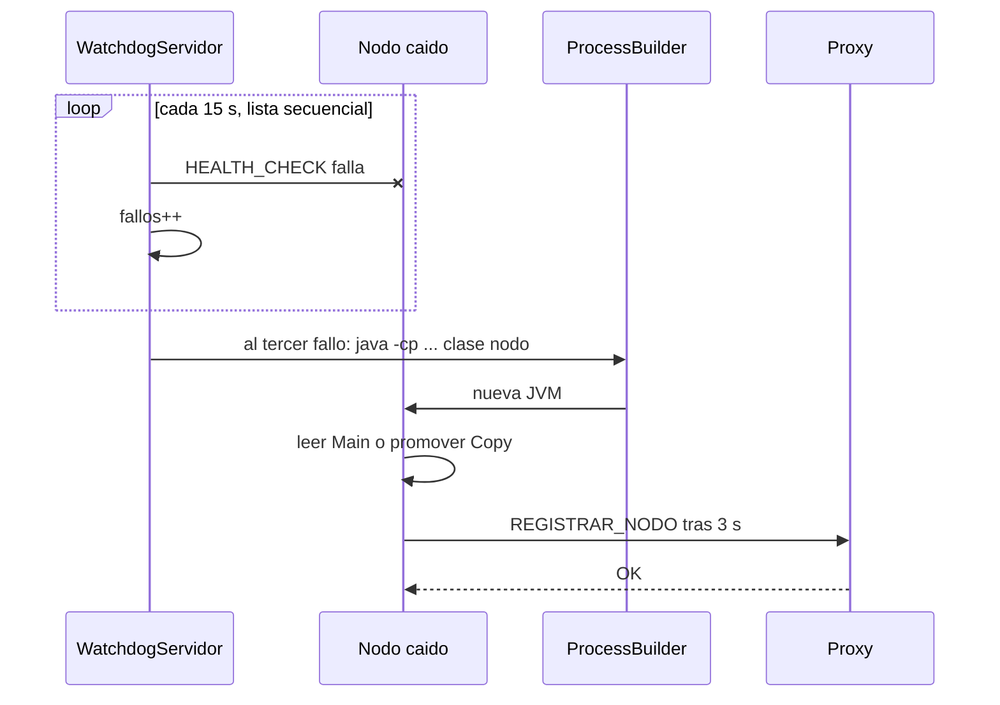

# Analisis completo del Sistema Steam Distribuido

> **Documento historico.** Describe el commit `f5ee219` anterior a la
> implementacion actual. Para operar y evaluar el sistema use `README.md` y las
> fuentes vigentes; las cifras de 35 clases y ausencia de pruebas ya no aplican.

> Revision del repositorio `P4bl0AGT/sistema-steam`, rama `main`, commit local
> `f5ee219cea4dcc3e6179b68a5f5ec4cff820e0e7` (20-06-2026).
>
> Fuente principal: las 35 clases de `src/main/java`. `README.md`, los scripts,
> los datos, logs, LaTeX, PDF y artefactos compilados se usaron para contrastar,
> no para sustituir la lectura del codigo.

## Como leer este analisis

- **Implementado**: existe una ruta de ejecucion comprobable en el codigo actual.
- **Documentado**: aparece en README, comentarios o informe, pero puede no coincidir con el codigo.
- **Incompleto o limitado**: existe parcialmente, sin todas las garantias que su nombre sugiere.
- **Hallazgo**: riesgo observado por inspeccion o evidencia historica en logs.
- Las rutas son relativas a la raiz del repositorio.
- No se modifico ninguna fuente. La unica adicion es este documento.
- Se verifico que las 35 fuentes compilan con `javac --release 17` y Gson 2.10.1
  en un directorio temporal. No hay pruebas automatizadas en `src/test`.

## Indice

1. [Inspeccion general](#1-inspeccion-general)
2. [Explicacion general](#2-explicacion-general)
3. [Arquitectura y procesos](#3-arquitectura-y-procesos)
4. [Protocolo de comunicacion](#4-protocolo-de-comunicacion)
5. [Proxy y balanceo](#5-proxy-y-balanceo)
6. [Servicio de sesiones](#6-servicio-de-sesiones)
7. [Servicio de juegos](#7-servicio-de-juegos)
8. [Servicio de mensajeria](#8-servicio-de-mensajeria)
9. [Relojes de Lamport](#9-relojes-de-lamport)
10. [Algoritmo Bully](#10-algoritmo-bully)
11. [Exclusion mutua distribuida](#11-exclusion-mutua-distribuida)
12. [Persistencia y replicacion](#12-persistencia-y-replicacion)
13. [Tolerancia a fallos](#13-tolerancia-a-fallos)
14. [Concurrencia](#14-concurrencia)
15. [Scripts y ejecucion](#15-scripts-y-ejecucion)
16. [Carga y falla inducida](#16-carga-y-falla-inducida)
17. [Logs](#17-logs)
18. [Mapa de clases](#18-mapa-de-clases)
19. [Flujos importantes](#19-flujos-importantes)
20. [Evaluacion critica](#20-evaluacion-critica)
21. [Errores y limitaciones priorizados](#21-errores-y-limitaciones-priorizados)
22. [Preparacion para la defensa](#22-preparacion-para-la-defensa)
23. [Hoja de estudio](#23-hoja-de-estudio)
24. [Segunda revision y conclusiones](#24-segunda-revision-y-conclusiones)

---

## 1. Inspeccion general

### 1.1 Arbol resumido y funcion

```text
sistema-steam/
|-- src/main/java/com/steam/       # codigo fuente Java
|   |-- cliente/                    # consola interactiva
|   |-- common/                     # protocolo, constantes, log, reloj, persistencia
|   |-- coordinacion/               # Bully, mutex y membresia
|   |-- modelos/                    # entidades y raices JSON
|   |-- proxy/                      # gateway y balanceador
|   |-- servidores/                 # sesiones, juegos, mensajeria y TTL
|   |-- carga/                      # carga y falla inducida
|   `-- watchdog/                   # supervisor de procesos
|-- scripts/                        # build, arranque, reset, carga y logs
|-- data/                           # estado JSON y membresia persistida
|-- logs/                           # evidencia de ejecuciones anteriores
|-- lib/gson-2.10.1.jar             # dependencia binaria vendorizada
|-- out/                            # clases generadas por 1_build.ps1
|-- target/                         # salida Maven y dependencias
|-- pom.xml                         # build Maven, Java 17, Gson 2.10.1
|-- sistema-steam.jar               # JAR generado, sin Main-Class unico
|-- README.md                       # guia y resultados declarados
|-- Cobertura_Rubricas_*.tex        # tres copias identicas del informe fuente
`-- Cobertura_Rubricas_*.pdf        # PDF compilado del informe
```

Tambien existe `.github/modernize/java-upgrade/` en el workspace local. Es estado
generado por una herramienta de modernizacion, esta ignorado por su propio
`.gitignore` y no pertenece al `HEAD` analizado.

| Carpeta/archivo | Clasificacion | Observacion real |
|---|---|---|
| `src/main/java` | Codigo fuente | 35 archivos; fuente autoritativa |
| `scripts` | Compilacion/ejecucion | Principalmente Windows `.bat` y PowerShell |
| `data` | Persistencia | JSON con extension `.txt`; `Main`, `Copy` y membresia |
| `logs` | Registros | Logs Java, reportes de carga y salidas del orquestador |
| `README.md`, `.tex`, `.pdf` | Documentacion | LaTeX repetido tres veces con el mismo hash |
| `out`, `target`, `sistema-steam.jar` | Generados | Clases/JAR; no son fuente primaria |
| `lib` | Dependencias | Gson 2.10.1 incluido en el repositorio |
| `pom.xml` | Configuracion de build | Java 17; copia dependencias a `target/dependency` |

### 1.2 Archivos que normalmente no deberian versionarse

El repositorio no tiene `.gitignore` raiz. Estan versionados `out/`, parte de
`target/`, `sistema-steam.jar`, `lib/*.jar`, `logs/`, archivos `.lck`, datos de
carga y el PDF. Normalmente se ignorarian:

```gitignore
/out/
/target/
/*.jar
/logs/
*.log
*.lck
*.class
*.tmp
```

`data/` requiere una decision: conviene versionar solo semillas pequenas y
anonimizadas, no sesiones, tokens, historiales ni resultados voluminosos. El PDF
puede conservarse como entregable, pero las tres copias identicas del `.tex` son
redundantes. No se elimino nada.

### 1.3 Contraste de artefactos

- `out/` contiene las clases de las 35 fuentes actuales.
- `target/classes` mezcla clases versionadas y clases no rastreadas; no debe usarse
  para inferir comportamiento.
- `sistema-steam.jar` contiene 41 `.class` (incluidas clases internas/records) y es
  el artefacto usado por los scripts de ejecucion.
- No existe `src/test`, Maven Surefire configurado expresamente, Docker, CI ni
  archivo de configuracion externo para hosts/puertos.

---

## 2. Explicacion general

### 2.1 Que problema resuelve

Es una plataforma academica de activos digitales inspirada en Steam. Permite
autenticarse, consultar/publicar juegos, reservar stock, confirmar compras con una
billetera, consultar ventas y mantener mensajeria uno a uno. La inspiracion en
Steam es funcional, no una reproduccion de su infraestructura: no hay descarga de
binarios, licencias DRM, pagos reales, amigos, matchmaking ni una base de datos
productiva.

La logica se divide en tres servicios, cada uno con dos procesos:

- **Sesiones**: usuarios, contrasenas, tokens y roles.
- **Juegos**: catalogo, stock, reservas, billeteras y ventas.
- **Mensajeria**: buzones, entrega e historial.

Un **Proxy** oculta esos nodos al cliente y balancea cada cluster. Los dos nodos de
cada servicio no tienen bases independientes: ambos abren los mismos archivos
locales de `data/`. Por ello la topologia tiene procesos distribuidos, pero el
almacenamiento es un recurso central compartido en el mismo host.

### 2.2 Usuarios y operaciones

| Rol | Operaciones visibles en `ClienteJava` | Controles del servidor |
|---|---|---|
| `COMPRADOR` | catalogo/compra, reservas, saldo, compras, mensajes, password | Comprar y consultar solo exigen token valido; no se comprueba expresamente el rol comprador |
| `VENDEDOR` | catalogo, publicar/modificar/eliminar propios, saldo, historial, mensajes | Publicar exige vendedor o admin; modificar/eliminar exigen propietario o admin |
| `ADMINISTRADOR` | crear/listar usuarios, recargar saldo, estadisticas, historial, eliminar, mensajes | Sesiones y juegos vuelven a validar token y rol para acciones privilegiadas |

Usuarios sembrados por el codigo actual en `svSesiones`:

- `admin/admin123`, rol `ADMINISTRADOR`.
- `vendedor1/pass123`, rol `VENDEDOR`.
- `cliente1` a `cliente50`, password `pass123`, rol `COMPRADOR`.

`svJuegos` siembra cinco juegos con stock 200 y saldo 1000 para cada comprador.
Esto difiere de la tabla del README y de `reset_datos.ps1`, que todavia hablan de
dos clientes con saldos 500/200.

### 2.3 Centralizado, distribuido y replicado

| Aspecto | Clasificacion correcta | Evidencia |
|---|---|---|
| Entrada de clientes | Centralizada | Todo cliente usa `Proxy:8080` |
| Servicios | Distribuidos por procesos | Dos JVM por cluster en puertos distintos |
| Balanceo | Centralizado | Contadores Round-Robin dentro de `Proxy` |
| Eleccion | Distribuida entre `svJuegos` | `GestorBully` en 9082/9282 |
| Mutex | Coordinador-centrico y limitado | `GestorMutexCentralizado` en 9182/9382 |
| Datos | Archivos compartidos centralizados | Ambos nodos usan las mismas constantes `*_MAIN` |
| `Copy` | Respaldo local periodico | `GestorSnapshot`: `Main -> Copy` cada 30 s |
| Replicacion entre nodos | **No implementada actualmente** | No hay `ReplicadorServidor/Cliente` en las fuentes |
| Membresia | Vista local del Proxy, persistida para auditoria | `RegistroMembresia`; no es fuente de descubrimiento al arrancar |

### 2.4 Flujo completo: comprador inicia sesion y compra

1. En `ClienteJava.menuSinSesion()` el usuario elige **1**. `login()` crea
   `MensajeProtocolo.request("LOGIN", null)` con `username/password`.
2. `ClienteJava.enviar()` abre una conexion TCP nueva a `localhost:8080`, estampa
   su Lamport y envia una linea JSON.
3. `Proxy.manejarCliente()` deserializa la linea. `Utils.clusterParaOperacion()`
   asigna `LOGIN` al cluster `SESIONES`.
4. `Proxy.rutear()` incrementa `rrSesiones`, elige 8081 u 8181, reemplaza el
   Lamport del request por el suyo y abre otra conexion TCP.
5. `svSesiones.manejarCliente()` actualiza su reloj y `login()` lee
   `data/SES_Main.txt`, verifica SHA-256, invalida sesiones previas del usuario,
   crea un UUID y guarda el JSON completo mediante temporal + `ATOMIC_MOVE`.
6. La respuesta con `token`, `rol` y `username` vuelve servidor -> Proxy -> cliente.
7. En el menu comprador se elige **1**. `flujoCompra()` primero envia
   `LISTAR_JUEGOS`, muestra numeros y conserva internamente cada `juegoId`.
8. Al elegir un numero, crea `COMPRAR_JUEGO` con token y `juegoId`. El Proxy lo
   envia por Round-Robin a 8082 o 8282.
9. `svJuegos.comprarJuego()` valida el token directamente contra 8081 y, si hay
   falla de transporte, 8181. Un resultado valido queda en cache 30 s.
10. Si el nodo de juegos no es coordinador y ya conoce al coordinador, llama
    `mutex.requestLock("stock", miId)`. Luego entra a su `synchronized(lock)` local.
11. Relee `GME_Main.txt`; valida juego activo, stock, reserva duplicada y compra
    previa. Reduce stock, crea `Reserva` con TTL de 5 minutos y guarda el archivo.
12. El `finally` envia `RELEASE` cuando se uso el mutex. La respuesta entrega el
    `reservaId` interno al cliente.
13. Si el comprador confirma, `ClienteJava.confirmarConId()` envia
    `CONFIRMAR_PAGO`. `svJuegos.confirmarPago()` valida reserva/TTL/saldo, debita al
    comprador, acredita al vendedor, incrementa `totalVentas`, agrega `Venta`,
    desactiva la reserva y vuelve a guardar `GME_Main.txt`.
14. `GME_Copy.txt` **no se actualiza en esa transaccion**: un `GestorSnapshot`
    independiente lo copia mas tarde.
15. Cada servidor estampa la respuesta; el Proxy la lee y la devuelve. Todas las
    conexiones se cierran al terminar el unico request/response.

Advertencia para la defensa: el paso 10 existe, pero no ofrece exclusion global
correcta porque el coordinador no adquiere el mismo `Semaphore` al ejecutar sus
propias compras. Este punto se demuestra en la seccion 11.

---

## 3. Arquitectura y procesos

### 3.1 Procesos ejecutables

| Proceso | Clase principal | Ruta | Puerto(s) | Responsabilidad | Se comunica con |
|---|---|---|---|---|---|
| Cliente | `ClienteJava` | `src/main/java/com/steam/cliente/ClienteJava.java` | Saliente a 8080 | UI y estado de sesion | Proxy |
| Proxy | `Proxy` | `src/main/java/com/steam/proxy/Proxy.java` | 8080 | gateway, RR, failover, health y membresia | clientes y seis nodos |
| Sesiones 1 | `svSesiones 1` | `src/main/java/com/steam/servidores/svSesiones.java` | 8081 | auth/tokens/usuarios | Proxy, juegos, mensajeria, watchdog |
| Sesiones 2 | `svSesiones 2` | misma ruta | 8181 | espejo funcional del proceso | mismos consumidores |
| Juegos 1 | `svJuegos 1` | `src/main/java/com/steam/servidores/svJuegos.java` | 8082, 9082, 9182 | negocio, Bully y mutex | Proxy, sesiones, Juegos 2 |
| Juegos 2 | `svJuegos 2` | misma ruta | 8282, 9282, 9382 | negocio, Bully y mutex | Proxy, sesiones, Juegos 1 |
| Mensajeria 1 | `svMensajeria 1` | `src/main/java/com/steam/servidores/svMensajeria.java` | 8083 | buzones e historial | Proxy, sesiones, watchdog |
| Mensajeria 2 | `svMensajeria 2` | misma ruta | 8383 | espejo funcional del proceso | mismos consumidores |
| Generador de carga | `GeneradorCarga` | `src/main/java/com/steam/carga/GeneradorCarga.java` | Saliente a 8080 y directo a 8082/8282 al final | 50 workers y metricas | Proxy; juegos para metricas |
| Falla inducida | `FallaInducida` | `src/main/java/com/steam/carga/FallaInducida.java` | Saliente a 8082/8282 | derriba coordinador y mide reeleccion | nodos de juegos directos |
| Watchdog | `WatchdogServidor` | `src/main/java/com/steam/watchdog/WatchdogServidor.java` | Saliente a los seis puertos de servicio | health y relanzamiento JVM | seis nodos |

Procesos auxiliares **dentro** de JVM, no ejecutables separados: health-check del
Proxy, `RegistradorProxy`, `GestorSnapshot`, `GestorLocks`, servidor y heartbeat de
`GestorBully`, y servidor/handlers de `GestorMutexCentralizado`.

### 3.2 Diagrama de arquitectura real



Todos los hosts son `localhost`. Por tanto son JVM separadas y sockets reales,
pero no una implantacion multi-maquina configurable.

---

## 4. Protocolo de comunicacion

### 4.1 Sobre comun

`MensajeProtocolo` esta en
`src/main/java/com/steam/common/MensajeProtocolo.java`. Sus campos reales son:

| Campo | Uso real |
|---|---|
| `requestId` | UUID correlacionado en respuesta; no hay tabla anti-replay ni deduplicacion |
| `tipo` | `REQUEST` o `RESPONSE` |
| `operacion` | constante que decide handler/cluster |
| `token` | bearer token; `null` en login/publicas/control |
| `rolUsuario` | definido, pero no usado para autorizar |
| `payload` | `Map<String,Object>` con parametros o datos de respuesta |
| `status` | `OK` o `ERROR` en respuestas |
| `mensaje` | texto humano |
| `timestamp` | se genera, pero no se valida ni detecta obsolescencia |
| `lamportClock` | reloj escalar del emisor/intermediario |

Ejemplo basado en `ClienteJava.flujoCompra()`:

```json
{
  "requestId": "9d2f...",
  "tipo": "REQUEST",
  "operacion": "COMPRAR_JUEGO",
  "token": "f4aa...",
  "payload": { "juegoId": "7b31..." },
  "timestamp": 1781970000000,
  "lamportClock": 42
}
```

Gson 2.10.1 ejecuta `toJson()/fromJson()`. Los numeros del `payload` vuelven como
`Double`; `getInt/getDouble` los normalizan. Los mensajes Bully y mutex tienen
POJOs JSON propios: `MensajeBully` y `MensajeMutex`.

### 4.2 Framing, sockets y ciclo de conexion

- UTF-8, `PrintWriter.println()` y `BufferedReader.readLine()`; una linea JSON es
  una trama. Un contenido de mensaje con salto de linea es escapado por Gson, por
  lo que el JSON fisico sigue en una linea.
- Cada solicitud abre una conexion cliente -> Proxy y otra Proxy -> servidor. No
  hay keep-alive de aplicacion, pool de conexiones ni multiplexacion.
- Validaciones de token, Bully, mutex, health y herramientas tambien abren sockets
  nuevos por intercambio.
- `setSoTimeout(5000)` limita **lecturas**, no el `connect()` de `new Socket(...)`;
  la conexion depende del timeout del sistema operativo.
- Los sockets principales usan try-with-resources y se cierran correctamente.
- Un JSON sintacticamente invalido puede lanzar una excepcion runtime no capturada
  por los handlers (solo capturan `IOException`); la tarea termina sin respuesta.
- No hay limite de tamano de linea, TLS, compresion, version de protocolo ni
  autenticacion de nodos internos.

### 4.3 Semantica ante fallos

Si el backend falla, el Proxy puede reenviar el mismo request al otro nodo. Esto
mejora disponibilidad, pero no da exactamente-una-vez: `requestId` no se almacena.
Si el primer nodo confirmo una venta y se perdio su respuesta, el segundo puede
responder "reserva no encontrada" aunque el dinero ya se movio. La semantica es
un intento de retry con riesgo de duplicacion o resultado ambiguo.

---

## 5. Proxy y balanceo

### 5.1 Implementacion

Clase: `src/main/java/com/steam/proxy/Proxy.java`.

- Constructor: precarga seis nodos hardcodeados como activos.
- `escuchar()`: `ServerSocket(8080)` y pool fijo de 30 hilos.
- `procesarRegistro()/procesarDesregistro()`: alta/reactivacion o baja dinamica.
- `Utils.clusterParaOperacion()`: SESIONES/JUEGOS/MENSAJERIA.
- `rutear()`: `AtomicInteger.getAndIncrement()` por cluster y recorrido circular.
- `reenviar()`: una conexion nueva, timeout de lectura 5 s.
- `iniciarHealthCheck()`: hilo daemon; duerme 10 s y recorre seis nodos en serie.

`CopyOnWriteArrayList`, `AtomicBoolean` y `AtomicInteger` permiten registros,
estados y RR concurrentes. La cola del `newFixedThreadPool(30)` no esta acotada;
`MAX_CONNECTIONS=100` esta declarado pero no se usa.

### 5.2 Escenarios

1. **Ambos disponibles**: el contador alterna el punto inicial; en condiciones
   normales se observa 1, 2, 1, 2. Si un nodo esta inactivo, se lo salta.
2. **Un nodo no responde**: una excepcion en `reenviar()` lo marca inactivo y el
   mismo request prueba el siguiente nodo. El health check tambien puede marcarlo
   dentro de su ronda periodica.
3. **Falla durante una solicitud**: si hay timeout/reset se reintenta. Si el nodo
   alcanzo a persistir antes del fallo, el resultado queda ambiguo y puede repetirse.
4. **Nodo recuperado**: su `RegistradorProxy` intenta registrarlo tras 3 s, hasta
   diez veces. Ademas, el health check lo vuelve activo al obtener `OK`.

### 5.3 Limites concretos

- El Proxy es un **punto unico de falla** y el watchdog no lo supervisa.
- Registro/desregistro no exige credenciales; solo acepta `localhost`, pero un
  proceso local puede alterar la tabla.
- Los nodos nacen activos antes del primer health check, aunque no esten iniciados.
- Si un backend devuelve EOF (`null`) sin lanzar excepcion, se prueba el siguiente
  pero no se marca inactivo en esa ruta.
- Cuando `rutear()` captura una excepcion, cambia `nodo.activo=false` pero no llama
  `membresia.marcarCaido()`. Si el siguiente health tambien obtiene `false`, no hay
  transicion y `MEMBRESIA.txt` puede seguir mostrando el estado anterior.
- Las rondas son secuenciales: seis timeouts de 5 s pueden hacer que una ronda
  tarde cerca de 30 s, ademas del sueno inicial de 10 s.
- `MEMBRESIA.txt` se actualiza en cambios/registro, no en cada heartbeat; usa el
  puerto como `id`, deja Bully/mutex en cero y no se lee al reiniciar el Proxy.
- `RegistroMembresia.coordinadorId` nunca es conectado con `GestorBully`.
- `VER_METRICAS_COORD` no esta en `Utils.clusterParaOperacion()`; la herramienta
  lo consulta directamente, no mediante Proxy.

---

## 6. Servicio de sesiones

### 6.1 Datos y autenticacion

Clase: `src/main/java/com/steam/servidores/svSesiones.java`; modelo persistido:
`BDSesiones { usuarios, sesiones }` en `data/SES_Main.txt`.

`login()` busca un `Usuario` activo, compara `SHA-256(password)` con
`passwordHash`, invalida cualquier sesion activa previa del mismo username y crea
`new Sesion(UUID.randomUUID(), username, rol)`. El token se persiste en claro.
`Sesion.vigente()` solo devuelve `activa`: no hay expiracion por edad o inactividad.
`ultimaActividad` se inicializa, pero `validarToken()` no la actualiza ni persiste.

| Operacion | Metodo | Validacion | Escritura |
|---|---|---|---|
| `LOGIN` | `login()` | credenciales y usuario activo | invalida sesiones anteriores y agrega token |
| `LOGOUT` | `logout()` | token activo | `activa=false` |
| `VALIDAR_TOKEN` | `validarToken()` | token activo | ninguna |
| `REGISTRAR_USUARIO` | `registrarUsuario()` | token admin, rol valido, username unico | agrega usuario con hash |
| `LISTAR_USUARIOS` | `listarUsuarios()` | token admin | ninguna |
| `CAMBIAR_PASS` | `cambiarPassword()` | token y password actual | reemplaza hash |

Todo handler entra a `synchronized(lock)` antes de leer/escribir. Ese monitor solo
protege los 30 workers de **una** instancia; el nodo 8081 y el 8181 tienen monitores
distintos y pueden hacer read-modify-write concurrente sobre el mismo archivo.

### 6.2 Flujo de validacion desde otro servicio

1. Juegos/mensajeria llama `ValidadorToken.validar(token)`.
2. Busca el token en un `ConcurrentHashMap` local con TTL 30 s.
3. En miss abre TCP directo a 8081 y envia `VALIDAR_TOKEN`.
4. Solo ante excepcion/ausencia de respuesta intenta 8181. Si 8081 responde
   `ERROR`, no consulta 8181.
5. Una validacion positiva se cachea; username/rol vuelven al handler.

Consecuencia: un `LOGOUT`, cambio de password o nuevo login puede dejar un token
anterior aceptable en cada cache hasta 30 s. `invalidarCache()` existe, pero ningun
flujo lo invoca. Nodo 1 recibe preferentemente toda la carga de validacion.

### 6.3 Seguridad real

Adecuada para una demostracion academica, no para produccion:

- UUID aleatorio ofrece suficiente entropia practica, pero es bearer token sin
  firma, audiencia, expiracion ni rotacion.
- TCP no usa TLS: password y token viajan en claro en localhost/red.
- SHA-256 directo no tiene sal ni factor de trabajo; debe sustituirse por Argon2,
  scrypt, bcrypt o PBKDF2 con sal individual.
- Tokens y hashes quedan versionados en `data/SES_*.txt`.
- `requestId` y `timestamp` no implementan anti-replay pese al comentario del POJO.

---

## 7. Servicio de juegos

### 7.1 Estado y reglas de negocio

`src/main/java/com/steam/servidores/svJuegos.java` persiste `BDJuegos`:

```text
catalogo: List<Juego>
reservas: List<Reserva>
ventas: List<Venta>
billeteras: Map<username, saldo>
```

Una compra tiene dos fases de aplicacion, no un protocolo de commit distribuido:

1. `COMPRAR_JUEGO`: descuenta una unidad y crea una reserva activa por 5 min.
2. `CONFIRMAR_PAGO`: valida reserva/saldo, mueve dinero y agrega la venta.

`GestorLocks` recorre reservas cada 30 s y restaura stock vencido. El nombre puede
confundir: no administra el mutex distribuido, sino el TTL de reservas.

### 7.2 Mapa de operaciones

| Operacion | Metodo | Datos modificados | Autorizacion | Mutex remoto |
|---|---|---|---|---|
| Listar/detalle | `listarJuegos()`, `verJuego()` | ninguno | publica | no |
| Reservar | `comprarJuego()` | `Juego.stock--`, nueva `Reserva` | token; no exige rol comprador | solo si no coordinador conocido |
| Pagar | `confirmarPago()` | billeteras, venta, `totalVentas`, reserva | token/propietario de reserva | solo si no coordinador conocido |
| Cancelar | `cancelarReserva()` | reserva inactiva, `stock++` | token/propietario | **no** |
| Publicar | `publicarJuego()` | catalogo, billetera vendedor | vendedor o admin | no |
| Modificar | `modificarJuego()` | nombre, descripcion, precio, `stockExtra` | propietario o admin | **no** |
| Eliminar | `eliminarJuego()` | `activo=false` | propietario o admin | no |
| Ver saldo | `verSaldo()` | ninguno | token | no |
| Recargar | `agregarSaldo()` | billetera objetivo | admin; no comprueba que objetivo exista | no |
| Historial/compras/juegos/reservas | metodos `ver*` | ninguno | token/filtro por identidad | no |
| Estadisticas | `verEstadisticas()` | ninguno | admin | no |
| Expirar | `GestorLocks.liberarReservasExpiradas()` | reserva, `stock++` | daemon | **no** |

### 7.3 Dos compradores simultaneos

En la misma JVM, `synchronized(lock)` serializa lectura, comprobacion de stock y
guardado, por lo que no venden dos veces la ultima unidad. Entre JVM distintas la
historia cambia:

- cada proceso tiene un `lock` Java diferente;
- el no-coordinador solicita el `Semaphore("stock")` del coordinador;
- el coordinador ejecuta sus propias compras directamente bajo su `lock` local,
  sin adquirir ese `Semaphore`;
- ambos pueden entrar a su seccion critica a la vez y reemplazar el JSON completo;
- la ultima escritura gana, pudiendo perder una reserva, venta o saldo.

Ademas, al arrancar antes de que Bully determine coordinador (`-1`), ambos nodos
omiten el mutex. Cancelacion, expiracion y aumento de stock tampoco lo usan.

### 7.4 Otras limitaciones transaccionales

- No hay rollback duradero ni journal. `ATOMIC_MOVE` hace indivisible el reemplazo
  del archivo, no atomica la transaccion entre procesos.
- Una reserva puede crearse aunque el saldo sea insuficiente; queda ocupando stock
  hasta cancelacion/TTL.
- Si el pago se guarda y su respuesta se pierde, el retry puede contestar error
  aunque la compra ya se completo.
- `Double` representa dinero; puede introducir error binario. Produccion usaria
  `BigDecimal` y una moneda explicita.
- La “biblioteca” no es una coleccion propia: `VER_MIS_COMPRAS` filtra `ventas`.
- El catalogo se carga y reescribe completo en cada operacion: costo O(tamano BD),
  contencion y crecimiento sin paginacion.
- La UI de vendedor obtiene juegos desde el catalogo publico, que excluye stock 0;
  por ello puede no poder seleccionar uno agotado para reponerlo, aunque la API
  directa si permite `stockExtra`.

---

## 8. Servicio de mensajeria

Clase: `src/main/java/com/steam/servidores/svMensajeria.java`; datos:
`BDMensajeria.mensajes` en `data/MSG_Main.txt`.

### 8.1 Envio y entrega

`enviarMensaje()` valida el emisor con `ValidadorToken`, impide autoenvio, crea un
`Mensaje` con UUID, reloj de pared y `relojLamport.tick()`, y reescribe el archivo.
No comprueba que el receptor exista ni este activo.

`verMensajes()` obtiene mensajes del receptor con `entregado=false`, los marca a la
vez `entregado=true` y `leido=true`, persiste y los devuelve. Es polling, no push.
El ACK es implicito y ocurre **antes** de saber si la respuesta llego al cliente:
una respuesta perdida puede ocultar esos mensajes para la siguiente consulta.

`verConversacion()` filtra ambos sentidos y ordena por:

```java
m.lamportClock > 0 ? m.lamportClock : m.timestamp
```

Esto mezcla escalas incompatibles para mensajes antiguos (`timestamp` en
milisegundos es mucho mayor que Lamport), no incluye desempate y no modifica
`leido`. El historial en los datos actuales crece sin limite ni paginacion.

### 8.2 Ejemplo Lamport

Supongamos que A envia `m1` con L=12; B recibe una respuesta/realiza otro envio y
su servidor actualiza a `max(local,12)+1`, luego guarda `m2` con L=14. Un mensaje
concurrente `m3` en el otro nodo podria tener L=13 o incluso empatar con otro
evento. El sort produce `m1, m3, m2` por numero.

La garantia formal es solo: si el evento de `m1` causa el de `m2` y todas las
comunicaciones actualizan correctamente el reloj, entonces `L(m1) < L(m2)`. El
reciproco es falso: `L(a) < L(b)` no demuestra causalidad. Lamport escalar no
distingue concurrencia ni proporciona por si solo un orden total unico; faltaria
un desempate, por ejemplo `(lamport, nodeId, messageId)`. En este proyecto, ademas,
el Proxy no incorpora correctamente el reloj recibido del cliente (seccion 9).

---

## 9. Relojes de Lamport

### 9.1 Implementacion exacta

`src/main/java/com/steam/common/RelojLamport.java` contiene:

- `private final AtomicLong reloj = new AtomicLong(0)`.
- `tick()`: `incrementAndGet()`.
- `update(received)`: loop CAS con `max(actual, received) + 1`.
- `get()`: lectura atomica.

```text
evento_local(): L = atomic_increment(L)
enviar(m):      m.L = atomic_increment(L); send(m)
recibir(m):     CAS hasta L = max(L, m.L) + 1
```

### 9.2 Donde se usa

| Componente | Envio/recepcion |
|---|---|
| `ClienteJava` | tick antes de request, update de response |
| `GeneradorCarga` | igual, compartido por los 50 workers |
| `Proxy` | tick antes de backend, update de response |
| `svSesiones`, `svJuegos`, `svMensajeria` | update al recibir, tick en respuesta |
| `svMensajeria.enviarMensaje()` | tick adicional guardado en `Mensaje` |
| `GestorBully` | todos los mensajes llevan reloj; update/tick |
| `GestorMutexCentralizado` | REQUEST/GRANT/RELEASE llevan reloj |
| `RegistroMembresia` | guarda `lamportJoin` generado por Proxy |
| Logs | `[LAMPORT]`, `[BULLY] t=`, `[MUTEX] t=` |

### 9.3 Defecto de propagacion en el Proxy

Al recibir del cliente, `Proxy.manejarCliente()` no ejecuta
`relojLamport.update(req.getLamportClock())`. En `rutear()` hace directamente
`req.setLamportClock(relojLamport.tick())`, sobreescribiendo el reloj cliente. Si
un cliente tiene L=100 y un Proxy recien iniciado L=0, el Proxy puede reenviar L=1:
se viola `L(envio_cliente) < L(recepcion_proxy)`. Por tanto la clase del reloj es
correcta y thread-safe, pero la integracion extremo a extremo es parcial.

Otras limitaciones: el reloj vuelve a cero al reiniciar cada JVM; no se persiste;
un health check tambien avanza el reloj del servidor; y no hay identificador de
nodo para desempatar valores iguales entre procesos.

---

## 10. Algoritmo Bully

### 10.1 Protocolo real

`GestorBully` solo vive en los dos procesos `svJuegos`. IDs: nodo 1 y nodo 2; gana
el mayor. Sus mensajes (`MensajeBully`) son `ELECTION`, `OK`, `COORDINATOR` y
`HEARTBEAT_COORD`, JSON sobre TCP dedicado.

1. `start()` abre servidor Bully, inicia heartbeat y espera 1,5 s.
2. `iniciarEleccion()` usa `AtomicBoolean.compareAndSet` para una eleccion local.
3. Envia `ELECTION` en paralelo a peers de ID mayor y espera hasta 3 s un `OK`.
4. Sin OK, `convertirseEnCoordinador()` fija su ID y difunde `COORDINATOR`.
5. Con OK, espera hasta 5 s el anuncio; si no llega, reinicia la eleccion.
6. El no-coordinador consulta al coordinador cada 5 s; la lectura espera hasta 3 s.

No existe un heartbeat del coordinador hacia los inferiores, persistencia del
lider, term/epoca, votos, mayoria, log replicado ni consenso.

### 10.2 Escenarios pedidos

**Arranque normal de ambos.** Nodo 2 no tiene mayores y se proclama. Nodo 1 envia
ELECTION, recibe OK y luego COORDINATOR=2. Los logs existentes muestran esta
secuencia (`svJuegos-1_0.log` y `svJuegos-2_0.log`).

**Nodo 1 primero.** Tras 1,5 s intenta 9282. Sin OK espera aproximadamente 3 s y
se proclama coordinador 1.

**Nodo 2 aparece despues.** Al iniciar, por ser el mayor se proclama 2 y envia
COORDINATOR al 1. El mayor recuperado desplaza al menor, comportamiento Bully.

**Cae nodo 2 coordinador.** Nodo 1 espera hasta el siguiente heartbeat (0-5 s),
falla el contacto y comienza eleccion. Aunque la conexion se rechace rapido, el
codigo espera el latch de OK hasta 3 s; luego se proclama. Estimacion nominal:
hasta unos 8 s, mas timeout de conexion del SO. El log de referencia midio 6.935 ms.

**Vuelve nodo 2.** Su eleccion automatica lo convierte nuevamente en coordinador y
lo anuncia. Depende de que su broadcast TCP alcance al nodo 1.

### 10.3 Carreras y limites

- Un `COORDINATOR` entrante se acepta sin comprobar que su ID sea el mayor.
- Los `CountDownLatch` son campos reutilizados; mensajes tardios de una eleccion
  anterior pueden afectar la actual.
- `fin` se crea y decrementa, pero nunca se espera.
- Una particion entre los dos nodos causa **split brain**: nodo 1 se autoproclama
  al no alcanzar al 2, mientras nodo 2 sigue creyendose coordinador.
- Dos nodos no forman mayoria tolerante: no se puede diferenciar nodo caido de red
  cortada. Bully elige por alcanzabilidad, no da consenso tipo Raft.
- `stop()` no cierra el `ServerSocket` bloqueado en `accept()`; los hilos son daemon
  y desaparecen al terminar la JVM, pero el cierre interno no es limpio.

---

## 11. Exclusion mutua distribuida

### 11.1 Mecanismo implementado

`GestorMutexCentralizado` abre un servidor en ambos nodos, aunque el comentario
dice que solo el coordinador otorga. Un no-coordinador:

1. consulta `bully.getCoordinadorActual()`;
2. abre TCP al puerto mutex del coordinador;
3. envia `REQUEST(recurso="stock")` y espera `GRANT` en la misma conexion;
4. ejecuta negocio;
5. abre otra conexion y envia `RELEASE`.

El receptor usa `ConcurrentHashMap<String,Semaphore>` y
`Semaphore(1).tryAcquire(10 s)`. La “cola” es la cola interna no justa del
semaforo, no una estructura FIFO explicita.

### 11.2 Secuencia desde nodo no coordinador



### 11.3 Por que la garantia es incompleta

El coordinador no adquiere `Semaphore("stock")` cuando el Proxy le entrega una
compra. Entra directamente a `svJuegos.lock`, un objeto sin relacion con el
semaforo del handler mutex. Por eso un GRANT al nodo 1 no impide que nodo 2 escriba
simultaneamente. Con dos nodos, el semaforo solo serializa peticiones remotas del
unico no-coordinador, cuyas propias peticiones ya se serializan con su lock local.

Ademas:

- cualquier servidor mutex procesa REQUEST sin verificar `bully.isCoordinador()`;
- RELEASE no valida propietario/requestId y puede aumentar permisos de mas;
- si un solicitante cae con el lock, no hay lease: queda tomado hasta reinicio del
  coordinador;
- si cae el coordinador, el nuevo crea semaforos vacios; puede solaparse con una
  seccion critica previamente concedida;
- si cambia coordinador entre GRANT y RELEASE, `releaseLock()` consulta al lider
  actual y puede liberar el semaforo equivocado;
- al arrancar con coordinador desconocido, `svJuegos` omite por completo el mutex;
- cancelar, expirar y aumentar stock no piden lock distribuido.

La relacion con Bully es solo descubrir el ID que centraliza el mutex. Bully no
transfiere estado de locks o colas durante una reeleccion.

---

## 12. Persistencia y replicacion

### 12.1 Archivos actuales

| Archivo | Contenido | Estado inspeccionado |
|---|---|---|
| `data/SES_Main.txt` | 52 usuarios, 3.149 sesiones | 12 activas |
| `data/SES_Copy.txt` | snapshot de sesiones | 3.066 sesiones, 35 activas; distinto a Main |
| `data/GME_Main.txt` | 5 juegos, 250 reservas, 205 ventas, billeteras | 45 reservas activas |
| `data/GME_Copy.txt` | snapshot de juegos | hash igual al Main inspeccionado |
| `data/MSG_Main.txt` | 2.528 mensajes | todos pendientes en esa carga |
| `data/MSG_Copy.txt` | snapshot de mensajes | 2.451; rezagado |
| `data/MEMBRESIA.txt` | seis estados vistos por Proxy | JUE-2 figura inactivo tras la falla |

Son JSON pretty-printed pese a la extension `.txt`. `GestorPersistencia<T>` lee
`Main`; en fallo intenta copiar `Copy` a un temporal de recuperacion y promoverlo.

### 12.2 Escritura, snapshot y recuperacion

```text
guardar(datos):
  serializar objeto completo
  escribir Main.<pid>.tmp
  move(REPLACE_EXISTING, ATOMIC_MOVE) a Main
  si ATOMIC_MOVE no existe, move no atomico

snapshot (cada 30 s):
  copiar Main a Copy.snap.tmp
  move atomico a Copy

leer():
  parsear Main
  si falla, copiar Copy a Main.recover.<pid>.tmp
  promover a Main y volver a parsear
```

El PID evita que dos JVM escriban el mismo temporal de `Main`. Los snapshots de
nodo 1 y 2 se escalonan 30/45 s, pero comparten `Copy.snap.tmp`; reinicios o
`snapshotInmediato()` podrian hacerlos coincidir.

### 12.3 Clasificacion de consistencia

- **No es replicacion primaria-secundaria**: no hay RPC ni log entre nodos.
- **No es consistencia fuerte**: no hay lock interproceso correcto, versionado ni
  compare-and-swap del archivo.
- **No es consistencia eventual entre replicas independientes**: solo existe un
  `Main` compartido.
- Es **almacenamiento central compartido + respaldo local periodico**. `Copy` puede
  perder hasta un intervalo de cambios al promoverlo.

`ATOMIC_MOVE` evita que un lector vea medio archivo cuando el filesystem lo
soporta; no evita lost updates: dos nodos pueden leer version V, producir V+A y
V+B, y la ultima sustitucion elimina el otro cambio. Tampoco hay `fsync`, checksum,
schema/version, retencion del corrupto ni validacion de `Copy` antes de promoverlo.
El snapshot puede copiar un Main semanticamente incorrecto o corrupto.

Los logs historicos contienen `MalformedJsonException`, temporales de recuperacion
en conflicto y mensajes `[REPL]` de clases que ya no existen. Es evidencia de
ejecuciones/revisiones anteriores, no prueba concluyente de que la version actual
con sufijo PID reproduzca la misma corrupcion. Si confirma, en cambio, que los
logs versionados no corresponden todos a una unica version del codigo.

---

## 13. Tolerancia a fallos

### 13.1 Mecanismos

| Mecanismo | Falla detectada | Accion | Tiempo aproximado | Limitaciones |
|---|---|---|---|---|
| Retry del Proxy | excepcion/timeout de backend | marca nodo inactivo y prueba otro | hasta 5 s de lectura, mas connect SO | operacion puede haberse ejecutado; no idempotencia |
| Health del Proxy | nodo no responde `HEALTH_CHECK` | activo/inactivo y membresia | duerme 10 s; ronda puede tardar hasta 30 s | secuencial, solo vista local, Proxy es SPOF |
| Registro asincrono | Proxy ausente al arrancar nodo | 10 intentos cada 3 s | primer intento tras 3 s; hasta 30 s | luego solo health hardcodeado puede descubrirlo |
| Heartbeat Bully | coordinador de juegos inaccesible | nueva eleccion | 0-5 s + hasta 3 s | particion produce split brain |
| Timeout mutex | no obtiene GRANT | error al cliente | 10-13 s internos | Proxy/cliente esperan solo 5 s; lock puede quedar tomado |
| Watchdog | 3 health fallidos | `ProcessBuilder` relanza JVM | nominal >=45 s, mayor si checks bloquean | no Proxy, no evita duplicados, no supervisa sus hijos |
| Snapshot | Main ausente/invalido al leer | promueve Copy | durante la lectura | Copy rezagado/no validado; posible perdida |
| `ATOMIC_MOVE` | escritura parcial por reemplazo | publica archivo completo | inmediato | no resuelve carreras logicas ni fsync |
| TTL reservas | cliente abandona reserva | restaura stock | hasta 5 min + 30 s | dos daemons, sin mutex interproceso |

### 13.2 Que ocurre al caer cada componente

- **Un nodo de sesiones**: Proxy reintenta el otro. Juegos/mensajeria prueban 8081
  y solo ante error de red 8181. Como ambos leen el mismo Main, siguen operando si
  ese archivo esta disponible. Watchdog intenta reinicio tras tres fallos.
- **Un nodo de juegos**: Proxy conmuta. Si era coordinador, el sobreviviente puede
  tardar unos 8 s en elegirse; durante ese lapso intenta pedir mutex al caido y su
  handler puede exceder el timeout de 5 s del Proxy.
- **Un nodo de mensajeria**: Proxy usa el otro; persiste sobre el mismo archivo.
- **Coordinador**: Bully reelige; no se recupera estado de mutex ni requests.
- **Proxy**: cliente y carga pierden toda entrada. Los servidores, validacion
  directa y Bully pueden seguir vivos. No existe Proxy secundario ni watchdog.
- **Cliente**: su socket se cierra; una reserva ya creada queda hasta TTL. No hay
  sesion en memoria del servidor, solo token persistido.
- **Watchdog**: desaparece el reinicio automatico, pero health/failover/Bully siguen.
- **Ambos nodos de un servicio**: Proxy devuelve `ERROR` “Todos los nodos...”. El
  generador lo cuenta como rechazo servido, no como perdida de transporte.
- **Almacenamiento `data/`**: ambos nodos del cluster fallan logicamente a la vez;
  la duplicacion de procesos no elimina ese punto comun.

---

## 14. Concurrencia

### 14.1 Mecanismos encontrados

| Mecanismo | Ubicacion | Proposito |
|---|---|---|
| `newFixedThreadPool(30)` | Proxy y tres servidores | atender conexiones concurrentes |
| `newCachedThreadPool()` | Bully y mutex | handlers/mensajes de coordinacion |
| `ScheduledExecutorService` | snapshots y watchdog | tareas periodicas |
| `synchronized(lock)` | sesiones, juegos, mensajeria, GestorLocks | serializar BD dentro de una JVM |
| metodos `synchronized` | `GestorPersistencia`, `RegistroMembresia.persistir`, formatter | proteger instancia/archivo local/formato |
| `AtomicLong` + CAS | Lamport y metricas | incrementos/update atomicos |
| `AtomicInteger` | RR Proxy | elegir indices sin carrera |
| `AtomicBoolean` | estado nodo, eleccion, stop | visibilidad y transiciones atomicas |
| `volatile` | coordinador/latches, coordinador membresia | visibilidad cross-thread |
| `ConcurrentHashMap` | cache token, semaforos, watchdog, membresia | acceso concurrente por clave |
| `CopyOnWriteArrayList` | clusters Proxy, latencias carga | iteracion segura |
| `Semaphore(1)` | mutex | exclusion remota parcial por recurso |
| `CountDownLatch` | Bully | esperar OK/COORDINATOR |
| hilos daemon | health, snapshot, Bully, mutex, TTL, registro | no impedir salida de JVM |

### 14.2 Riesgos

- **Race/lost update interproceso**: los monitores y `GestorPersistencia` no cruzan
  JVM; es el riesgo principal.
- **Mutex desacoplado**: semaforo remoto y lock local del coordinador son recursos
  diferentes.
- **Split brain**: dos coordinadores y escrituras simultaneas en una particion.
- **Lock leak/starvation**: sin lease/propietario; `Semaphore` no justo; requests
  bloquean workers del pool cached.
- **Backpressure ausente**: pools fijos usan cola no acotada y los cached pools
  pueden crear muchos hilos.
- **`CopyOnWriteArrayList` para latencias**: cada `add` copia el arreglo completo;
  costo cuadratico/memoria bajo una carga larga.
- **JSON runtime**: `JsonSyntaxException` no se captura en handlers; una tarea del
  executor puede morir silenciosamente y cerrar socket sin error JSON explicito.
- **Connect sin timeout explicito**: un thread puede bloquear mas que `TIMEOUT_MS`.
- **Cierre incompleto**: pools y ServerSockets no tienen shutdown coordinado. En
  ejecucion normal es intencional; `stop()` de Bully/mutex no desbloquea `accept`.
- **No deadlock de monitores evidente**: no hay dos monitores locales adquiridos en
  orden inverso. El bloqueo operacional mas probable es semaforo no liberado.
- **Archivos snapshot**: dos procesos comparten `Copy.snap.tmp`; el escalonamiento
  reduce, pero no elimina, coincidencias tras reinicios.
- **Sockets**: las rutas principales usan try-with-resources; no se observo una
  fuga sistematica, aunque handlers bloqueados conservan sockets hasta timeout.

---

## 15. Scripts y ejecucion

### 15.1 Requisitos reales

- JDK con `java`, `javac` y `jar`; las fuentes apuntan a Java 17.
- Gson 2.10.1 en `lib/`, o red para que `1_build.ps1` lo descargue.
- Windows para los `.bat` y su classpath `;`.
- `1_build.ps1` funciona con Windows PowerShell moderno, pero ademas necesita que
  `jar` este en PATH. El README menciona PowerShell 7+, aunque `pwsh` no es usado
  por los `.bat`.
- Alternativa Maven: `1_build.bat` exige `mvn`, contradiciendo la afirmacion global
  “No se requiere Maven”; esa afirmacion solo aplica al build PowerShell.

### 15.2 Compilar

Opcion sin Maven:

```powershell
.\scripts\1_build.ps1
```

Descarga Gson si falta, borra/recrea `out`, genera un argfile temporal para las 35
fuentes, ejecuta `javac --release 17`, crea `sistema-steam.jar` y elimina el
argfile. Opcion Maven:

```powershell
.\scripts\1_build.bat
# internamente: mvn clean package -q
```

El JAR no tiene una clase main unica; siempre se lanza con `-cp` y nombre de clase.
`13_run_prueba_trafico.ps1` no compila: hay que construir antes para evitar usar un
JAR obsoleto.

### 15.3 Preparar datos

Con servidores detenidos, para obtener la siembra actual se deben **eliminar** los
seis `SES/GME/MSG Main/Copy`, como hace el orquestador. `reset_datos.ps1` escribe
JSON vacio pero no archivos de longitud cero. Los constructores de sesiones/juegos
exigen que ambos archivos sean ausentes o de longitud 0, por lo que ese script no
vuelve a sembrar usuarios/juegos. Es un bug del script, no una instruccion fiable.

### 15.4 Orden manual

```text
2_run_sesiones1.bat      8081
3_run_sesiones2.bat      8181
4_run_juegos1.bat        8082 + Bully 9082 + Mutex 9182
5_run_juegos2.bat        8282 + Bully 9282 + Mutex 9382
6_run_mensajeria1.bat    8083
7_run_mensajeria2.bat    8383
8_run_proxy.bat          8080
9_run_cliente.bat        cliente interactivo
```

Los servidores pueden arrancar antes del Proxy porque `RegistradorProxy` reintenta,
pero ese orden facilita la primera ronda. Los scripts anuncian puertos de
“Repl” 9482/9582, 9483/9583 y 9484/9584 que **ninguna fuente actual abre**.

### 15.5 Demo, carga, falla y watchdog

```powershell
# demo automatizada: borra datos, levanta 7 JVM, carga, falla y teardown
.\scripts\13_run_prueba_trafico.ps1 -Hilos 50 -DuracionSeg 60 -EsperaFalla 30

# carga manual
.\scripts\10_run_generador_carga.ps1 -Hilos 50 -DuracionSeg 60
# o 10_run_generador_carga.bat

# falla manual, en otra terminal
.\scripts\11_run_falla_inducida.bat

# supervisor, despues de servidores
.\scripts\12_run_watchdog.bat

# visor
.\scripts\ver_logs.bat
```

`13_run_prueba_trafico.ps1` escala el arranque para evitar doble siembra, espera
14 s tras Proxy, ejecuta falla en background y carga en foreground, muestra
`orq_falla.out` y mata con `Stop-Process -Force` las JVM que creo.

### 15.6 Detencion y portabilidad

Para manual, cerrar cada consola con Ctrl+C y verificar que no queden procesos
`java`. No hay script de parada graceful global. No conviene enviar
`SHUTDOWN_GRACEFUL` salvo a juegos: solo ese servicio lo implementa y la operacion
no exige autenticacion.

Limitaciones:

- no hay preflight de puertos; procesos viejos pueden atender la prueba y quedar
  fuera del arreglo `$procs` del orquestador;
- rutas relativas exigen ejecutar desde la raiz (los scripts hacen `cd`);
- `.bat`, `Start-Process -WindowStyle`, `Stop-Process` y classpath `;` atan la demo
  a Windows;
- stdout/stderr del orquestador se redirigen a `orq_*.out/.err`; Java Logging usa
  stderr para consola, por lo que `.err` voluminoso no significa solo errores;
- el teardown forzado puede impedir hooks/desregistro y deja el estado de membresia
  historico hasta que el Proxy tambien termina.

---

## 16. Carga y falla inducida

### 16.1 Generador

`GeneradorCarga.main()` usa por defecto 50 threads durante 60 s. Cada worker se
asigna a `cliente1..cliente50` y repite:

```text
LOGIN -> LISTAR_JUEGOS -> COMPRAR_JUEGO -> CONFIRMAR_PAGO
      -> ENVIAR_MENSAJE al siguiente cliente -> LOGOUT
```

El juego se elige con `Random`. Cada request abre nueva TCP. Mide:

- `totalPeticiones` antes de conectar;
- respuestas `OK`;
- toda respuesta `ERROR` como `respuestasRechazo`;
- EOF/JSON nulo/`IOException` como `perdidas`;
- latencia solo de respuestas recibidas;
- throughput final = total / duracion configurada;
- p95 ordenando todas las latencias y tomando indice `floor(n*0.95)`;
- mensajes Bully/mutex consultando directamente los nodos vivos al final.

### 16.2 Validez de las metricas

- Un `ERROR` del Proxy por cluster completamente caido se clasifica como “rechazo
  de negocio”, aunque es indisponibilidad. La tasa de perdida subestima fallas.
- No separa timeout de connect, reset, EOF y JSON corrupto.
- El p95 esta una posicion por encima de la definicion nearest-rank en varios
  tamanos; mas importante, excluye perdidas y puede ocultar sus 5 s.
- Divide por 60 aunque workers puedan finalizar despues por requests en curso.
- `CopyOnWriteArrayList` perturba el benchmark al copiar en cada muestra.
- Silencia excepciones inesperadas del worker.
- Si `Hilos > 50`, reutiliza usernames; cada login invalida la sesion previa y
  altera el resultado.
- Si un nodo de juegos murio, sus contadores se omiten al final; el total de
  coordinacion no representa necesariamente toda la corrida.
- Mide carga local en una maquina con archivos compartidos, no latencia de red real
  ni escalabilidad multinodo.

### 16.3 Resultados existentes

| Log | Total | req/s | Promedio | p95 | OK | Rechazos | Perdidas | Coord |
|---|---:|---:|---:|---:|---:|---:|---:|---:|
| `carga_1781218292887.log` | 24.769 | 412,8 | 121,1 ms | 219 ms | 16.045 | 8.724 | 0 | 1.964 |
| `carga_1781218001786.log` | 23.966 | 399,4 | 124,9 ms | 230 ms | 30 | 23.936 | 0 | 10 |
| `carga_1781216964321.log` | 19.177 | 319,6 | 156,2 ms | 291 ms | 1.365 | 17.812 | 0 | 14 |
| `carga_1781216750999.log` | 46.933 | 782,2 | 65,3 ms | 325 ms | 0 | 25.656 | 21.277 (45,3%) | 10 |

La cifra del README corresponde casi exactamente al primer log de la tabla (el
README redondea 24.720/412). Existe evidencia de esa ejecucion, pero los otros tres
resultados demuestran que no es una garantia reproducible. Una corrida con casi
todo rechazado no valida correctamente el flujo de negocio aunque tenga 0% de
“perdidas”.

### 16.4 Falla inducida

`FallaInducida` espera 30 s, pregunta directamente `QUIEN_ES_COORDINADOR`, envia
`SHUTDOWN_GRACEFUL` sin token y sondea cada 200 ms al sobreviviente hasta que
`soyCoordinador=true`. `logs/orq_falla.out` registra coordinador 8282 y recuperacion
en 6.935 ms.

Eso mide **recuperacion del rol de control**, no recuperacion end-to-end: no hace
una compra de prueba, no comprueba consistencia ni detecta solicitudes ambiguas.
Tampoco mata abruptamente el proceso: solicita salida ordenada con 200 ms de
gracia. Es diferente de crash, `kill -9`, particion o disco fallido.

Definiciones para la defensa:

- **Error de transporte**: no hay respuesta util por connect/timeout/reset/EOF.
- **Rechazo de negocio**: respuesta valida, por ejemplo ya comprado o sin saldo.
- **Timeout**: subtipo de error de transporte; no prueba que no se ejecuto.
- **Perdida de solicitud**: el servidor no la proceso; no puede deducirse solo del
  timeout.
- **Recuperacion**: el servicio vuelve a aceptar y completar operaciones correctas;
  la herramienta actual solo observa la eleccion.

---

## 17. Logs

### 17.1 Configuracion

`GestorLog.configurar(componente)` reemplaza handlers del root logger:

- archivo `logs/<componente>_%g.log`;
- 5 MiB por archivo, 5 generaciones, append;
- archivo nivel `ALL`, consola nivel `INFO`;
- formato `[fecha hora.ms] [NIVEL] [componente] mensaje`;
- handler global de excepciones no capturadas con stack trace y flush.

Los executors capturan excepciones de sus tareas en `Future`; por ello el handler
global no garantiza registrar toda runtime exception de un worker.

`GeneradorCarga` usa aparte `FileHandler(logFile, true)` sin rotacion y
`SimpleFormatter`.

### 17.2 Lineas representativas

```text
[...][INFO][svJuegos-1] [BULLY] t=2 ELECTION enviado a nodo-2
```

Nodo 1 inicio eleccion y contacto al ID mayor. `t=2` es su Lamport local.

```text
[...][INFO][svJuegos-2] [MUTEX] t=31731 GRANT recurso=stock solicitante=nodo-1
```

El coordinador adquirio su semaforo y respondio GRANT; no demuestra que sus
handlers de negocio locales hayan quedado excluidos.

```text
[...][WARNING][Proxy] [PROXY] Nodo JUE-2 fallo: Connection reset
```

Una solicitud en vuelo perdio la conexion; Proxy marco ese nodo inactivo e intento
otro. No indica si JUE-2 alcanzo a persistir.

```text
[...][INFO][Proxy] [HEALTH] Nodo SES-2 ACTIVO
```

Transicion de estado observada; health exitosos sin cambio quedan en `FINE` o no
generan esta linea.

```text
[...][WARNING][svSesiones-1] Error leyendo data/SES_Main.txt: MalformedJsonException
```

Evidencia historica de JSON invalido; algunos logs tambien mencionan clases/temps
de revisiones antiguas y deben fecharse junto al commit antes de atribuirlos al
codigo actual.

Los `.lck` son locks internos de `FileHandler` y no logica del sistema. La
rotacion explica `_0.log`, `_1.log`, etc. Los `orq_*.err` contienen la salida de
consola normal porque `ConsoleHandler` escribe a stderr.

---

## 18. Mapa de clases

### Cliente, protocolo y utilidades

| Clase | Ruta | Responsabilidad | Metodos principales | Se comunica con |
|---|---|---|---|---|
| `ClienteJava` | `src/main/java/com/steam/cliente/ClienteJava.java` | menu y requests | `login`, `flujoCompra`, `enviar` | Proxy |
| `MensajeProtocolo` | `src/main/java/com/steam/common/MensajeProtocolo.java` | sobre JSON | `request`, `ok`, `error`, `toJson`, `fromJson` | todos |
| `Constantes` | `src/main/java/com/steam/common/Constantes.java` | puertos/ops/timeouts | constantes | todos |
| `Utils` | `src/main/java/com/steam/common/Utils.java` | hash y ruteo | `hashPassword`, `clusterParaOperacion` | sesiones/Proxy |
| `RelojLamport` | `src/main/java/com/steam/common/RelojLamport.java` | reloj thread-safe | `tick`, `update`, `get` | todos |
| `GestorLog` | `src/main/java/com/steam/common/GestorLog.java` | logging/rotacion | `configurar` | filesystem |
| `ValidadorToken` | `src/main/java/com/steam/common/ValidadorToken.java` | auth remota/cache | `validar`, `invalidarCache` | sesiones |
| `RegistradorProxy` | `src/main/java/com/steam/common/RegistradorProxy.java` | alta/baja de nodos | `registrarAsync`, `desregistrar` | Proxy |

### Proxy, servicios y persistencia

| Clase | Ruta | Responsabilidad | Metodos principales | Se comunica con |
|---|---|---|---|---|
| `Proxy` | `src/main/java/com/steam/proxy/Proxy.java` | gateway/RR/health | `rutear`, `reenviar`, `iniciarHealthCheck` | cliente/nodos |
| `svSesiones` | `src/main/java/com/steam/servidores/svSesiones.java` | usuarios/tokens | `login`, `validarToken`, `registrarUsuario` | Proxy/filesystem |
| `svJuegos` | `src/main/java/com/steam/servidores/svJuegos.java` | transacciones | `comprarJuego`, `confirmarPago`, handlers CRUD | Proxy/sesiones/coordinacion/filesystem |
| `svMensajeria` | `src/main/java/com/steam/servidores/svMensajeria.java` | chat/buzon | `enviarMensaje`, `verMensajes`, `verConversacion` | Proxy/sesiones/filesystem |
| `GestorLocks` | `src/main/java/com/steam/servidores/GestorLocks.java` | expirar reservas | `run`, `liberarReservasExpiradas` | BD juegos |
| `GestorPersistencia<T>` | `src/main/java/com/steam/common/GestorPersistencia.java` | JSON atomico/fallback | `leer`, `guardar`, `inicializarSiVacio` | Main/Copy |
| `GestorSnapshot` | `src/main/java/com/steam/common/GestorSnapshot.java` | backup periodico | `start`, `tomarSnapshot` | Main/Copy |

### Coordinacion, fallos y pruebas

| Clase | Ruta | Responsabilidad | Metodos principales | Se comunica con |
|---|---|---|---|---|
| `GestorBully` | `src/main/java/com/steam/coordinacion/GestorBully.java` | eleccion/heartbeat | `start`, `iniciarEleccion`, `convertirseEnCoordinador` | peer juegos |
| `MensajeBully` | `src/main/java/com/steam/coordinacion/MensajeBully.java` | DTO Bully JSON | `toJson`, `fromJson` | GestorBully |
| `GestorMutexCentralizado` | `src/main/java/com/steam/coordinacion/GestorMutexCentralizado.java` | REQUEST/GRANT/RELEASE | `requestLock`, `releaseLock`, `manejarPeticion` | peer juegos |
| `MensajeMutex` | `src/main/java/com/steam/coordinacion/MensajeMutex.java` | DTO mutex JSON | `toJson`, `fromJson` | mutex |
| `MutexTimeoutException` | `src/main/java/com/steam/coordinacion/MutexTimeoutException.java` | fallo de GRANT | constructor | juegos |
| `NodoInfo` | `src/main/java/com/steam/coordinacion/NodoInfo.java` | peer id/puertos | constructor | Bully/mutex |
| `EstadoNodo` | `src/main/java/com/steam/coordinacion/EstadoNodo.java` | estado persistible | constructor | membresia |
| `RegistroMembresia` | `src/main/java/com/steam/coordinacion/RegistroMembresia.java` | vista del Proxy | `registrar`, `marcarCaido`, `persistir` | filesystem |
| `WatchdogServidor` | `src/main/java/com/steam/watchdog/WatchdogServidor.java` | supervision/restart | `verificar`, `reiniciar` | seis nodos/OS |
| `GeneradorCarga` | `src/main/java/com/steam/carga/GeneradorCarga.java` | workload/metricas | `cicloWorker`, `enviar`, `imprimirReporteFinal` | Proxy/juegos |
| `FallaInducida` | `src/main/java/com/steam/carga/FallaInducida.java` | shutdown/medicion | `encontrarCoordinador`, `medirRecuperacion` | juegos |

### Modelos

| Clase | Ruta | Datos |
|---|---|---|
| `BDSesiones` | `src/main/java/com/steam/models/BDSesiones.java` | usuarios, sesiones |
| `BDJuegos` | `src/main/java/com/steam/models/BDJuegos.java` | catalogo, reservas, ventas, billeteras |
| `BDMensajeria` | `src/main/java/com/steam/models/BDMensajeria.java` | mensajes |
| `Usuario` / `Sesion` | `src/main/java/com/steam/models/Usuario.java`, `Sesion.java` | identidad, hash, rol, token/actividad |
| `Juego` | `src/main/java/com/steam/models/Juego.java` | catalogo y stock |
| `Reserva` | `src/main/java/com/steam/models/Reserva.java` | reserva, TTL y estado |
| `Venta` | `src/main/java/com/steam/models/Venta.java` | transaccion completada |
| `Mensaje` | `src/main/java/com/steam/models/Mensaje.java` | emisor/receptor/contenido/tiempos/estado |

---

## 19. Flujos importantes

### 19.1 Inicio de sesion



### 19.2 Compra de un juego



### 19.3 Envio de mensaje



### 19.4 Consulta de conversacion



### 19.5 Health check del Proxy



### 19.6 Failover hacia nodo espejo



### 19.7 Eleccion Bully

```mermaid
sequenceDiagram
    participant N1 as GestorBully nodo 1 :9082
    participant N2 as GestorBully nodo 2 :9282
    N1->>N2: ELECTION id=1, Lamport
    N2-->>N1: OK id=2
    N2->>N2: no hay ID mayor; coordinador=2
    N2->>N1: COORDINATOR id=2
    loop cada 5 s desde no-coordinador
        N1->>N2: HEARTBEAT_COORD
        N2-->>N1: OK
    end
    Note over N1,N2: Si N2 cae, N1 espera heartbeat + eleccion y se proclama
```

### 19.8 Solicitud y liberacion del mutex



### 19.9 Caida y recuperacion con Watchdog



---

## 20. Evaluacion critica

| Dimension | Evaluacion | Justificacion |
|---|---|---|
| Arquitectura | Adecuado para proyecto academico | separacion cliente/Proxy/tres servicios y procesos reales; almacenamiento/Proxy centralizados |
| Modularidad | Adecuado para proyecto academico | paquetes y POJOs claros; `svJuegos` concentra 840 lineas y muchas responsabilidades |
| Claridad | Adecuado para proyecto academico | nombres/Javadocs utiles, pero varios comentarios prometen `Main + Copy` inmediato o replicadores inexistentes |
| Manejo de errores | Parcialmente implementado | timeouts/retry y respuestas de negocio; runtime JSON, resultados ambiguos y excepciones silenciadas |
| Concurrencia | Riesgoso | buena proteccion intraproceso; coordinacion interproceso incorrecta y archivos compartidos |
| Seguridad | Riesgoso | roles parciales, SHA-256 simple, TCP/token en claro, control shutdown sin auth |
| Escalabilidad | Riesgoso | JSON completo, disco compartido, 30 threads, nueva TCP y validacion directa por request |
| Consistencia | Riesgoso | last-writer-wins sin version/quorum/transaccion interproceso |
| Tolerancia a fallos | Parcialmente implementado | retry, health, Bully, backup y watchdog; SPOF y split brain |
| Mantenibilidad | Parcialmente implementado | constantes centralizadas; scripts/docs desalineados y artefactos/logs versionados |
| Portabilidad | Parcialmente implementado | Java y `File.pathSeparator` ayudan; scripts y localhost atan a Windows/una maquina |
| Documentacion | Adecuado para proyecto academico | README/LaTeX extensos; algunas afirmaciones exceden el codigo actual |
| Pruebas | No implementado | no hay unitarias/integracion/CI; solo carga y falla demostrativa |

Fortalezas tecnicas reales:

1. Protocolo comun JSON simple y facil de inspeccionar.
2. Separacion por servicios y dos instancias ejecutables por cluster.
3. Failover inmediato del Proxy mas health periodico.
4. Implementacion thread-safe aislada de Lamport y Bully demostrable en logs.
5. Escritura por temporal/rename, snapshot y herramientas de carga/falla integradas.

---

## 21. Errores y limitaciones priorizados

### Criticos

| Prioridad | Problema | Evidencia | Consecuencia | Posible solucion |
|---|---|---|---|---|
| Critica | Lost updates entre JVM sobre JSON compartido | `GestorPersistencia.synchronized` es por instancia; seis nodos comparten `*_Main` | sesiones, ventas, saldo o mensajes perdidos | BD transaccional o escritor primario + replicacion/version CAS |
| Critica | Mutex no excluye operaciones del coordinador | `svJuegos.comprarJuego/confirmarPago` omiten mutex si coordinador; handler usa otro `Semaphore` | doble entrada y reemplazo de estado | todos, incluido lider, adquieren el mismo lock; leases/fencing tokens |
| Critica | Split brain con dos nodos | Bully sin quorum; coordinador no detecta aislamiento del menor | dos lideres y corrupcion logica | minimo 3 nodos y consenso/quorum (Raft), fencing en almacenamiento |
| Critica | Retry no idempotente | Proxy reenvia `requestId`, pero ningun servicio deduplica | cobro ejecutado con respuesta de error o efecto duplicado | tabla idempotency-key y respuesta persistida por operacion |
| Critica | Operaciones de control sin autenticacion | `SHUTDOWN_GRACEFUL`, registro y coordinacion aceptan TCP local sin credenciales | cualquier proceso local puede apagar juegos/alterar control | mTLS o secreto de servicio, ACL y auth de control |

### Importantes

| Prioridad | Problema | Evidencia | Consecuencia | Posible solucion |
|---|---|---|---|---|
| Importante | Propagacion Lamport rota en Proxy | `rutear()` hace tick/overwrite sin `update(request.L)` | no se conserva causalidad cliente -> Proxy | update al recibir; tick separado al enviar |
| Importante | Logout no revoca caches | `ValidadorToken` TTL 30 s; `invalidarCache` sin usos | token viejo aceptado temporalmente | introspeccion sin cache o invalidacion distribuida/TTL corto |
| Importante | Backup no es replica | `GestorSnapshot` local cada 30 s | perdida de cambios y mismo dominio de falla | replicas en hosts/discos distintos y protocolo de replicacion |
| Importante | Locks sin lease/ownership | RELEASE no valida holder; crash no libera | bloqueo o permisos >1 | lease con expiracion, requestId holder, fencing |
| Importante | Restauraciones de stock sin mutex | cancelar, GestorLocks, `stockExtra` | carreras y stock incorrecto | unica capa transaccional para toda mutacion del recurso |
| Importante | Clasificacion de carga engañosa | todo `ERROR` cuenta rechazo | 0% perdida puede ocultar cluster caido | codigos de error tipados: business/availability/transport |
| Importante | Seguridad de credenciales | SHA-256 sin sal, TCP/token persistido | robo/reuso y cracking barato | TLS, Argon2id, tokens expirables, secretos fuera de Git |
| Importante | Mensajes marcados antes de entrega | `verMensajes()` persiste ACK antes de responder | perdida visible al cliente tras reset | ACK explicito posterior o entrega at-least-once con IDs |
| Importante | Receptor/recarga no verifican usuario | `enviarMensaje`, `agregarSaldo` | datos huerfanos | consulta autoritativa a sesiones o FK en BD |
| Importante | Watchdog puede lanzar duplicados | resetea contador tras `pb.start`, no guarda PID/espera health | multiples JVM, conflicto de puerto | registrar proceso, cooldown, verificar salida y health |
| Importante | Proxy unico | solo puerto 8080 y no supervisado | caida total de entrada | dos gateways, VIP/DNS/balanceador externo |
| Importante | Membresia puede quedar obsoleta | fallo en `Proxy.rutear()` solo cambia flag; health sin transicion no persiste | auditoria `MEMBRESIA.txt` incorrecta | actualizar registro en toda transicion o derivarlo de una unica maquina de estados |
| Importante | Reset manual no resiembra | script escribe JSON no vacio; constructor exige archivo vacio | demo arranca sin usuarios/juegos | borrar archivos o cambiar condicion de siembra |

### Menores

| Prioridad | Problema | Evidencia | Consecuencia | Posible solucion |
|---|---|---|---|---|
| Menor | Puertos de replicacion fantasma | `.bat` muestran 9482-9584; no hay listeners | confusion en defensa | quitar lineas o implementar/documentar canal real |
| Menor | Comentarios obsoletos | referencias `ReplicadorServidor`, “Main + Copy” | sobrepromesa documental | alinear Javadocs/README con comportamiento |
| Menor | Sin `.gitignore` raiz | logs, class, target, out versionados | repo pesado/ruidoso | agregar ignore y conservar solo fixtures necesarios |
| Menor | Tres `.tex` identicos | mismo SHA-256 | duplicacion | una fuente canonica |
| Menor | `MAX_CONNECTIONS`, `rolUsuario`, `Sesion.vigente` sin uso | busqueda de simbolos | deuda y falsa expectativa | usar o eliminar con cambio documentado |
| Menor | p95 indice no estandar | `sorted.get((int)(size*0.95))` | pequena desviacion | nearest-rank o libreria HDR Histogram |
| Menor | Sin paginacion/retencion | listas completas | crecimiento y respuestas grandes | indices, consultas paginadas, archivado |
| Menor | Sin version de protocolo | JSON libre | cambios incompatibles | campo `protocolVersion` y schema |

---

## 22. Preparacion para la defensa

### 22.1 Explicacion oral de 1 minuto

“Sistema Steam es un proyecto academico Java que separa autenticacion, juegos y
mensajeria en tres servicios con dos JVM cada uno. El cliente solo conoce un Proxy
TCP en el puerto 8080; este identifica la operacion, hace Round-Robin y reintenta
otro nodo cuando uno falla. Los mensajes son JSON delimitados por salto de linea y
transportan token, requestId y reloj de Lamport. Los nodos de juegos ejecutan Bully
para elegir al de mayor ID como coordinador y un mutex centralizado intenta proteger
el stock. Los datos se guardan en archivos JSON `Main` mediante rename atomico y se
copian periodicamente a `Copy`. Hay health checks, watchdog, generador de 50 hilos y
una falla inducida. Es una demostracion distribuida valida a nivel de procesos,
pero no un sistema productivo: Proxy y archivos son puntos centrales, el mutex no
excluye correctamente al coordinador y no hay consenso ni replicacion real.”

### 22.2 Explicacion oral de 3 minutos

“El problema funcional es gestionar usuarios, un catalogo con stock y compras en
dos pasos, y mensajes offline. `ClienteJava` crea `MensajeProtocolo` JSON y abre una
TCP nueva a `Proxy:8080`. `Utils.clusterParaOperacion` decide si va a sesiones,
juegos o mensajeria; el Proxy usa un `AtomicInteger` por cluster para Round-Robin y
mantiene un flag activo por nodo. Ante excepcion prueba el espejo y, en paralelo,
un daemon hace health cada 10 segundos.

Sesiones corre en 8081/8181. Compara contrasenas SHA-256, crea tokens UUID y
persiste usuarios/sesiones. Juegos corre en 8082/8282: reservar descuenta stock y
crea un TTL de cinco minutos; confirmar mueve saldo y registra una venta. Un daemon
restaura reservas vencidas. Mensajeria corre en 8083/8383: guarda mensajes y los
entrega por polling; las conversaciones se ordenan por la marca de Lamport.

Cada proceso tiene un `RelojLamport` con `AtomicLong`; al recibir aplica
`max(local, recibido)+1`. En juegos, los puertos 9082/9282 implementan Bully: el ID
2 gana, el nodo 1 hace heartbeat y se reelige si el 2 cae. Los puertos 9182/9382
implementan REQUEST, GRANT y RELEASE con semaforos.

La tolerancia incluye retry, health, Bully, snapshots y Watchdog. La prueba
versionada alcanzo 24.769 requests, 412,8 req/s, p95 219 ms y reeleccion en 6,935 s.
Pero explicaria sus limites: los dos nodos comparten el mismo archivo `Main`,
`Copy` es backup local, el Proxy es unico y el mutex remoto no bloquea las compras
locales del coordinador. Esos puntos impiden afirmar consistencia fuerte.”

### 22.3 Explicacion tecnica de 7 minutos

1. **Topologia.** “Hay siete procesos de servicio en la demo: Proxy y seis nodos;
   cliente, carga, falla y watchdog son procesos adicionales. Todo corre en
   localhost, pero las JVM se comunican por TCP real.”
2. **Protocolo.** “`MensajeProtocolo` contiene tipo, operacion, token, payload,
   status, mensaje, timestamps y requestId. Gson serializa; `println/readLine`
   enmarca. Se abre una conexion por salto y por request. SO_TIMEOUT es 5 s de
   lectura, no connect timeout.”
3. **Proxy.** “Tres listas `CopyOnWriteArrayList`, flags `AtomicBoolean` y tres
   contadores `AtomicInteger`. `rutear()` comienza en el siguiente indice y recorre
   nodos activos. Un fallo en vuelo activa retry, pero sin idempotencia: timeout no
   significa que el backend no haya confirmado.”
4. **Servicios.** “Sesiones autentica y emite tokens; juegos/mensajeria validan
   directo contra 8081 y luego 8181 con cache positiva de 30 s. Juegos modela
   reserva y pago; mensajeria modela buzones y polling.”
5. **Concurrencia.** “Cada servidor tiene pool de 30 y un monitor local. Esto
   funciona dentro de una JVM. `GestorPersistencia` tambien sincroniza su instancia
   y publica archivos completos con `ATOMIC_MOVE`. Pero cada nodo es otra JVM; no
   comparte esos monitores.”
6. **Lamport.** “La clase usa `AtomicLong` y CAS. La propiedad correcta es
   causalidad implica orden de reloj, no al reves. Hay una integracion parcial:
   Proxy sobreescribe el reloj cliente sin actualizarse primero, y dos procesos
   pueden empatar. Para orden total usaria `(L,nodeId,id)`.”
7. **Bully.** “ID mayor gana. Nodo 1 envia ELECTION al 2, recibe OK y espera
   COORDINATOR. Un heartbeat cada 5 s dispara eleccion; con dos nodos, fallo se
   detecta en hasta aproximadamente 8 s. No hay quorum, asi que una particion
   produce dos lideres.”
8. **Mutex.** “El no-lider pide un semaforo al lider. El defecto es que las
   operaciones locales del lider usan otro monitor y no ese semaforo. Tampoco hay
   lease ni transferencia de locks. Por ello lo presentaria como protocolo
   implementado pero garantia incompleta.”
9. **Persistencia.** “Main es estado compartido y Copy snapshot. El temporal por
   PID y rename reducen corrupcion fisica, pero no lost updates. No es
   primaria-secundaria ni eventual: es almacenamiento central + backup.”
10. **Fallos y demo.** “Proxy conmuta, Watchdog relanza tras tres rondas, Bully
    reelige y FallaInducida mide solo que el sobreviviente se declare lider. Los
    reportes distinguen response OK, response ERROR y ausencia de respuesta, aunque
    clasifican indisponibilidad respondida como rechazo. Para produccion migraria a
    una BD transaccional/replicada, 3+ nodos con consenso, idempotencia, TLS, hashes
    lentos, gateway redundante y pruebas automatizadas.”

### 22.4 Preguntas de profesor y respuestas

1. **¿Por que TCP?** Porque se requiere entrega ordenada y fiable de una linea JSON
   request/response. Simplifica el proyecto frente a implementar ACK/retransmision
   sobre UDP. No ofrece por si solo exactamente-una-vez ni seguridad.

2. **¿Como se delimitan mensajes?** `PrintWriter.println` envia un JSON por linea y
   `BufferedReader.readLine` lee una trama. Solo se procesa una por conexion.

3. **¿Se reutilizan conexiones?** No. Cliente, Proxy, validacion, health, Bully y
   mutex crean sockets por intercambio.

4. **¿Por que existe un Proxy?** Da transparencia de ubicacion, rutea por operacion,
   balancea y concentra deteccion/retry; el cliente solo conoce 8080.

5. **¿El Proxy es punto unico de falla?** Si. No hay segundo Proxy, VIP ni watchdog
   para el gateway. Si cae, el cliente no llega a ningun servicio.

6. **¿Como funciona Round-Robin?** Cada cluster tiene un `AtomicInteger`. Se toma
   `getAndIncrement() mod n` como inicio y se recorre circularmente saltando nodos
   inactivos.

7. **¿Que pasa si el nodo elegido falla?** `rutear()` captura la excepcion, lo marca
   inactivo y prueba otro. Puede duplicar una operacion ya ejecutada cuya respuesta
   se perdio.

8. **¿Como vuelve un nodo?** Se registra asincronamente en Proxy tras arrancar o el
   health check detecta `OK` y cambia `activo=true`.

9. **¿Que garantiza Lamport?** Si `a -> b` causalmente y se aplican las reglas en
   todas las comunicaciones, `L(a) < L(b)`.

10. **¿Que no garantiza Lamport?** No sincroniza hora fisica, no permite inferir
    causalidad desde `<`, no distingue concurrencia y no da un orden total unico sin
    desempate.

11. **¿La integracion Lamport es correcta de extremo a extremo?** No del todo:
    Proxy no hace `update` con el reloj cliente antes de sobreescribirlo con su tick.

12. **¿Por que Bully?** Es pequeno, demostrable y el criterio de mayor ID es claro
    para dos nodos. Sirve para eleccion academica, no para consenso de datos.

13. **¿Por que no Raft?** Raft agrega terminos, mayoria y log replicado; con solo dos
    nodos no tolera una caida conservando mayoria. Para produccion se usarian al
    menos tres. Bully fue una eleccion de alcance, no equivalente a Raft.

14. **¿Que ocurre si cae el coordinador?** El no-lider falla un heartbeat, inicia
    eleccion y, sin respuesta de un ID mayor, se proclama. Nominalmente tarda hasta
    unos 8 s; el log midio 6,935 s.

15. **¿Que ocurre si vuelve el nodo de mayor ID?** Su eleccion automatica lo
    proclama y difunde `COORDINATOR`, desplazando al menor.

16. **¿Que pasa en una particion?** Nodo 1 no alcanza al 2 y se proclama; nodo 2
    puede seguir coordinador. Sin quorum hay split brain.

17. **¿Como se evita modificar stock a la vez?** Dentro de una JVM con
    `synchronized(lock)`. Entre JVM se intenta REQUEST/GRANT/RELEASE, pero la
    garantia es defectuosa porque el coordinador no adquiere su propio semaforo.

18. **¿Que pasa si un nodo muere con lock?** No hay lease: el semaforo del
    coordinador queda tomado. Si cae el coordinador, el nuevo pierde ese estado y
    arranca libre, con riesgo de solapamiento.

19. **¿Que diferencia hay entre replicacion y respaldo?** Replicacion mantiene
    copias activas mediante un protocolo; respaldo es una copia para recuperar.
    `GestorSnapshot` implementa lo segundo.

20. **¿El sistema garantiza consistencia fuerte?** No. Dos procesos pueden leer la
    misma version y reemplazar Main con resultados distintos; la ultima escritura
    gana.

21. **¿Para que sirve ATOMIC_MOVE?** Para publicar un archivo completo de una vez.
    Evita lectura parcial, no conflictos logicos ni perdida de actualizaciones.

22. **¿Como funciona el Watchdog?** Un scheduler comprueba seis puertos cada 15 s.
    Tras tres fallos crea `java -cp ... clase nodo` y redirige logs.

23. **¿Que no supervisa Watchdog?** Proxy, el propio watchdog, consistencia de
    datos, puertos Bully/mutex y procesos duplicados.

24. **¿Que representa p95?** Un umbral bajo el cual cae aproximadamente 95% de las
    latencias servidas. El codigo usa indice `floor(n*0.95)` y excluye perdidas.

25. **¿La prueba demuestra cero perdida?** Solo segun su clasificacion. Un `ERROR`
    “todos los nodos caidos” cuenta como rechazo servido, por lo que puede haber
    indisponibilidad con 0 en `perdidas`.

26. **¿Que limita una topologia de dos nodos?** No puede formar mayoria tras perder
    uno, diferencia mal fallo/particion y facilita split brain.

27. **¿Que parte escala peor?** Releer y reescribir listas JSON completas, seguido
    por el Proxy unico, validacion concentrada en sesiones 1 y una conexion por
    request.

28. **¿Los tokens son seguros?** Tienen entropia de UUID, pero no expiracion, firma,
    TLS ni revocacion inmediata de caches. Solo son apropiados para demo local.

29. **¿Como se entregan mensajes offline?** Se persisten con `entregado=false` y
    `VER_MENSAJES` por polling los marca entregados/leidos. No hay push ni ACK
    posterior del cliente.

30. **¿Que mejoraria primero para produccion?** BD transaccional replicada, escritor
    unico o consenso de 3+ nodos con fencing; idempotencia; TLS/auth robusta; Proxy
    redundante; contratos de error y pruebas de integracion/fallo.

---

## 23. Hoja de estudio

### Proposito y componentes

- Steam academico: usuarios, catalogo, reservas/pago, billeteras, ventas y chat.
- Cliente -> Proxy -> dos nodos de sesiones/juegos/mensajeria.
- Watchdog relanza; carga mide; falla apaga al coordinador.

### Puertos para memorizar

| Componente | Puerto |
|---|---:|
| Proxy | 8080 |
| Sesiones 1 / 2 | 8081 / 8181 |
| Juegos 1 / 2 | 8082 / 8282 |
| Mensajeria 1 / 2 | 8083 / 8383 |
| Bully juegos 1 / 2 | 9082 / 9282 |
| Mutex juegos 1 / 2 | 9182 / 9382 |

No memorizar como implementados los puertos 9482-9584: solo aparecen en scripts
obsoletos.

### Clases esenciales

`ClienteJava`, `MensajeProtocolo`, `Proxy`, `svSesiones`, `svJuegos`,
`svMensajeria`, `ValidadorToken`, `RelojLamport`, `GestorBully`,
`GestorMutexCentralizado`, `GestorPersistencia`, `GestorSnapshot`,
`WatchdogServidor`, `GeneradorCarga`, `FallaInducida`.

### Algoritmos y mecanismos

- Round-Robin atomico por cluster y retry secuencial.
- Lamport: local/send `+1`; receive `max+1`; integracion Proxy incompleta.
- Bully: mayor ID gana; heartbeat 5 s; sin quorum.
- Mutex: REQUEST/GRANT/RELEASE con semaforo; garantia global incompleta.
- Concurrencia local: pools, monitores, atomicos, concurrent collections.
- Fallos: health 10 s, watchdog 15 s x 3, snapshot 30 s, TTL 5 min.

### Persistencia

- `SES_Main/Copy`: usuarios y tokens.
- `GME_Main/Copy`: juegos, reservas, ventas y billeteras.
- `MSG_Main/Copy`: mensajes.
- `MEMBRESIA`: vista/auditoria del Proxy.
- Main compartido + Copy backup; no replicas independientes.

### Orden de demo

Compilar, eliminar datos con servidores detenidos, iniciar 6 nodos, Proxy, cliente.
Para demo automatica usar script 13 tras build y verificar puertos libres. Los
usuarios actuales son admin, vendedor1 y cliente1..50.

### Frases que conviene decir con precision

- “Hay distribucion de procesos, pero almacenamiento central compartido.”
- “Copy es snapshot de respaldo, no replica activa.”
- “Lamport conserva una condicion de orden causal; no prueba causalidad ni tiempo.”
- “Bully elige lider, no replica datos ni alcanza consenso.”
- “El mutex esta implementado como protocolo, pero su exclusion global es parcial.”
- “Timeout significa resultado desconocido, no necesariamente operacion perdida.”
- “El Proxy mejora transparencia y failover, pero es un SPOF.”

---

## 24. Segunda revision y conclusiones

### 24.1 Comprobaciones realizadas

- Se enumeraron las 35 fuentes y las ocho clases con `main`.
- Se leyeron `README.md`, `pom.xml`, todos los `.java`, todos los scripts, modelos,
  datos y muestras de cada familia de logs.
- Se contrastaron las tres copias LaTeX (identicas) y se extrajo texto del PDF.
- Se contrastaron `out`, `target` y las 41 clases del JAR solo como generados.
- Se verificaron por busqueda los nombres de metodos usados en este documento.
- Se confirmaron todos los puertos en `Constantes.java` y en los listeners reales.
- Se compilaron las 35 fuentes con Java 17/Gson en un directorio temporal: 41
  clases generadas, sin modificar `out`, `target` ni el JAR.
- No se ejecuto una nueva prueba de 60 s porque alteraria datos/logs y el encargo
  prohibe modificar el proyecto; se analizaron las cuatro corridas existentes.

### 24.2 Implementado frente a documentado

| Afirmacion documental | Veredicto tras revisar codigo |
|---|---|
| “persistencia replicada” | respaldo local periodico sobre almacenamiento compartido |
| `guardar` actualiza Main + Copy | falso en codigo actual; solo Main, snapshot despues |
| puertos `Repl` 9482-9584 | no implementados |
| dos compradores 500/200 | obsoleto; 50 compradores con 1000 |
| `requestId` anti-replay y timestamp anti-obsolescencia | campos presentes, controles ausentes |
| Lamport estrictamente creciente | por instancia si; no global, y Proxy rompe propagacion cliente |
| orden causal/total del chat | sort escalar implementado; garantia formal parcial y sin desempate |
| mutex protege stock entre nodos | protocolo presente; exclusion global incorrecta |
| recuperacion ~7 s | evidencia de reeleccion 6,935 s; no prueba recuperacion transaccional |
| 0% perdida | cierto segun metrica de una corrida; clasificacion oculta errores respondidos |

### 24.3 Conclusion

El proyecto es valioso como laboratorio porque hace visibles sockets, procesos,
relojes logicos, eleccion, coordinacion, health checks y fallos. Su mejor defensa no
es afirmar garantias productivas, sino explicar exactamente su frontera: la
arquitectura distribuye computo y demuestra algoritmos, mientras que Proxy,
persistencia y coordinacion conservan puntos centrales y carreras. Reconocer esa
frontera, con los metodos citados, demuestra comprension real de sistemas
distribuidos.
